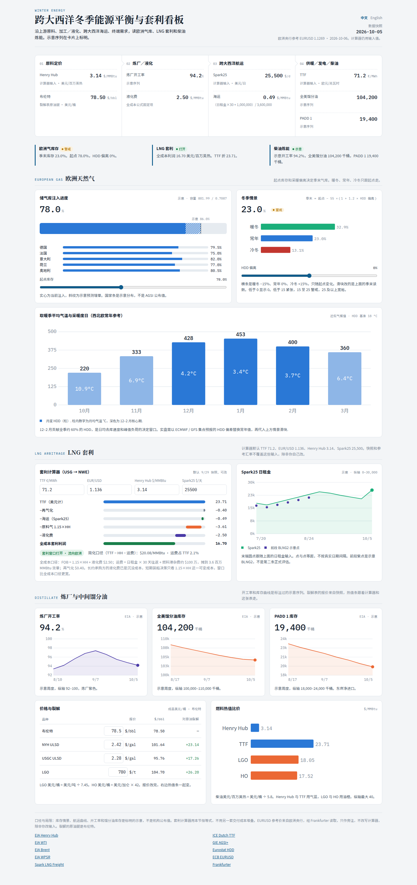
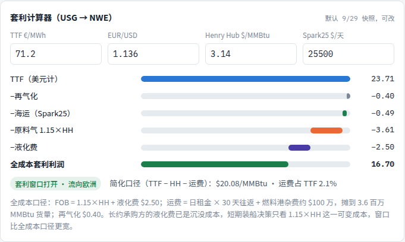
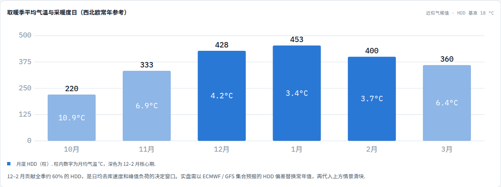

[https://iris0614.github.io/energy-dashboard/](https://iris0614.github.io/energy-dashboard/)

跨大西洋冬季能源平衡与套利看板 reads European gas storage, LNG arbitrage, and distillate from feedstock through Atlantic freight. The header switches between 中文 and English. Illustrative series are labeled on the cards. Snapshot numbers are in [`data.json`](data.json).

## Demo

Chinese desktop, full page.



Arbitrage waterfall. Each cost is subtracted from the right.



Heating-degree chart. The monthly mean temperature sits inside each bar.



## Local

```bash
python -m http.server
```

Then open [`index.html`](index.html). [`index.html`](index.html) and [`transatlantic-energy-dashboard.html`](transatlantic-energy-dashboard.html) are the same file.

[https://github.com/iris0614/energy-dashboard](https://github.com/iris0614/energy-dashboard)
